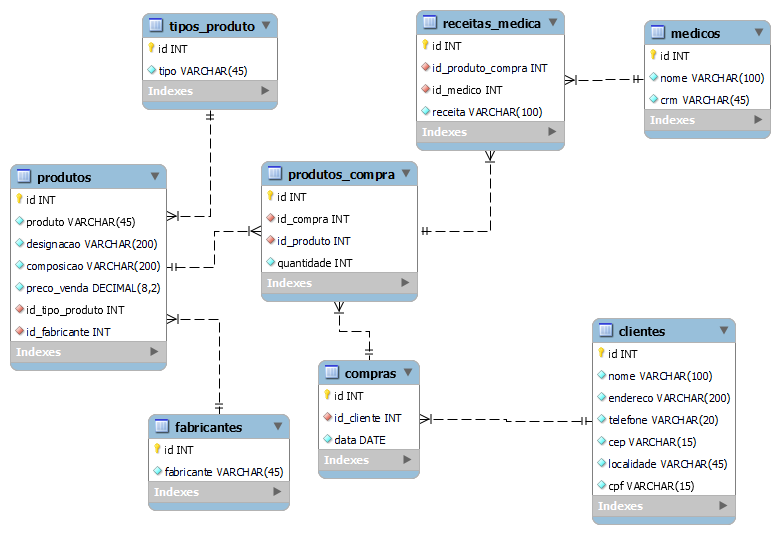

# Farmácia 💊 MySQL 🛢️

> Projeto de cadastro e consulta de estoque farmacêutico

#

#### Desafio 🏁

Uma farmácia comercializa vários tipos de produtos (remédios, cosméticos, etc.). Além do tipo, para cada produto são
registrados o código, designação, composição, fabricante e preço de venda. Quando um cliente compra pela 1o vez um
produto são registrados os seus dados (nome, endereço, telefone, código postal, localidade e número de contribuinte).
Depois de cadastrado, sempre que um cliente compra um determinado produto é registrado seu código de cliente, os
produtos adquiridos, o nome do médico (no caso das receitas médica), bem como o total da venda. Cada compra é
identificada por um número para facilitar as consultas à base de dados.

#

### Skills 🧠

* #### SQL
    * ###### Create - DDL
    * ###### Insert - DML    
    * ###### Select - DML
    * ###### Delete - DML
    * #### Junção de produto cartesiano

#

### Stack 🗃️

> ### MySQL Workbench🐬

#

<h3>Diagrama ER 📈</h3>

